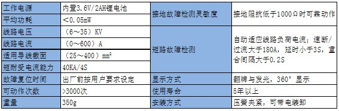

## 架空指示器源码  
配电网系统中，线路分支较多，运行方式复杂，线路的管理维护工作量很大，而线路故障指示器能够弥补输供电故障查询的不足，为快速查询故障点，快速恢复供电提供有力的保障。  
  
主要功能：
1. 自动识别短路故障：具有自适应功能，能够根据目前的负荷电流自动设置过流定值，不需要设定动作值； 
2. 可以检测接地故障：可以很准确的检测到接地故障；  
3. 可以与其他设备通信：将故障信息、报警信息等与其它设备共享；  
4. 可以自动复位：在出厂时设置好复位时间，计时时间到后自动复位；  
5. 涌流制动算法：独特的涌流识别算法解决了因线路涌流或系统倒送电而导致的指示器误动问题；  
6. 可以带电装卸：采用绝缘操作杆和专用安装、拆卸工具可以带电装卸，避免设备安装造成的停电损失；  
7. 可以全天侯指示：翻牌和发光指示相结合，既可以满足白天观察，也可以满足阴雨天和夜间观察；  
技术参数：  
   
